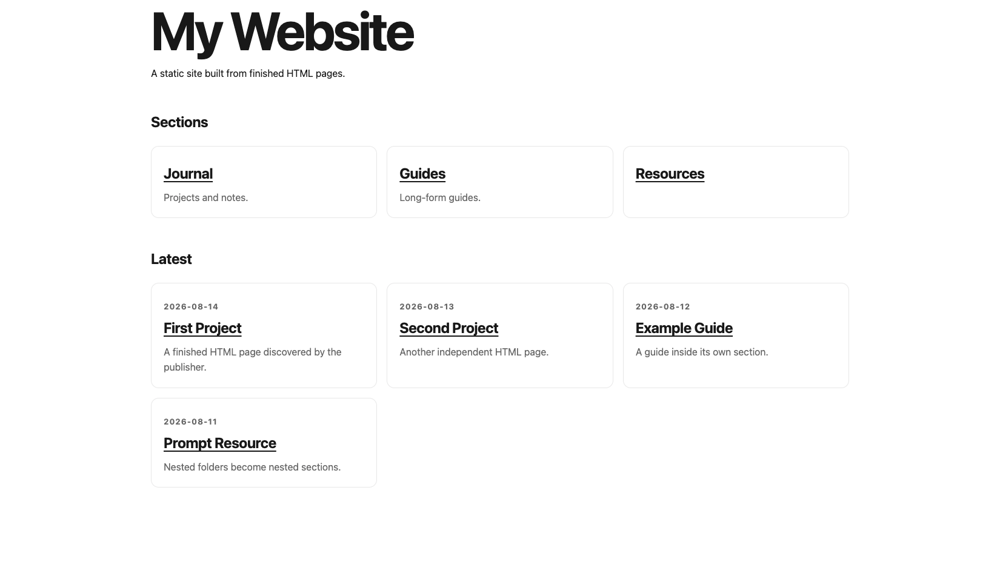

# Static Folder Publisher

[](https://github.com/emaf205/static-folder-publisher/actions/workflows/ci.yml)
[](https://github.com/emaf205/static-folder-publisher/actions/workflows/pages.yml)
[](https://github.com/emaf205/static-folder-publisher/releases/latest)
[](LICENSE)

**Bring your HTML. Organize it in folders. Publish a complete static site.**

Static Folder Publisher is a **white-label, HTML-first static publishing engine**.

Put finished HTML pages into folders. Static Folder Publisher automatically generates the website structure around them — without rewriting your pages and without requiring a CMS, database, admin panel, runtime server, or JavaScript framework.

> **Your folders become the website.**

**[Live Demo](https://emaf205.github.io/static-folder-publisher/)** · **[Latest Release](https://github.com/emaf205/static-folder-publisher/releases/latest)** · **[Changelog](CHANGELOG.md)** · **[Validation](VALIDATION.md)**

---

## Live demo

[](https://emaf205.github.io/static-folder-publisher/)

**[Open the live demo →](https://emaf205.github.io/static-folder-publisher/)**

The demo itself is generated by Static Folder Publisher and deployed automatically through GitHub Actions and GitHub Pages.

---

## The idea in 20 seconds

```text
content/
├── journal/
│   ├── first.html
│   └── second.html
├── guides/
│   └── guide.html
└── resources/
    └── prompts/
        └── prompt.html
```

Run:

```bash
publisher build
```

and the folders become a complete static website:

```text
dist/
├── index.html
├── journal/
│   ├── index.html
│   ├── first.html
│   └── second.html
├── guides/
│   ├── index.html
│   └── guide.html
├── resources/
│   ├── index.html
│   └── prompts/
│       ├── index.html
│       └── prompt.html
├── sitemap.xml
├── rss.xml
└── 404.html
```

Your source HTML is copied **unchanged**.

The publisher generates the structure around it.

---

## How it works

```text
Finished HTML files
        ↓
Put them into folders
        ↓
publisher build
        ↓
Homepage + section indexes + navigation
        ↓
Sitemap + RSS + 404
        ↓
Static /dist website
        ↓
Deploy anywhere
```

The filesystem is the content model:

- **folder = section**
- **HTML file = page**
- **build = automation**

---

## Why this exists

Most publishing systems ask you to put your content inside their system.

Static Folder Publisher does the opposite.

- Your finished HTML stays yours.
- Folders define the website structure.
- No CMS is required.
- No database is required.
- No server runtime is required.
- No product branding is injected.
- The final output is ordinary static files.
- Deploy anywhere that can serve HTML.

> **Publishing a website becomes almost as simple as organizing files into folders.**

---

## Quick start

Requires **Python 3.10+**.

```bash
python -m pip install -e .
publisher validate
publisher build
publisher serve
```

Open the local URL printed by `publisher serve`.

To remove generated output:

```bash
publisher clean
```

You can also run without installing the command:

```bash
PYTHONPATH=src python -m static_folder_publisher build
```

---

## Zero configuration

This is enough:

```text
content/
└── articles/
    └── hello.html
```

`publisher build` creates the missing site structure automatically.

For production, set your real URL in `config.json` so canonical URLs, RSS and the sitemap use the correct domain, or override it for one command without changing the project:

```bash
publisher build --base-url https://example.com/my-site
```

---

## V1 principles

- HTML is first-class content.
- Content folders become sections; asset-only subfolders stay assets instead of becoming navigation entries.
- `content/` is read-only during build.
- `dist/` is disposable generated output.
- No database or server runtime.
- No product branding is inserted into generated websites.
- Navigation on generated pages works without JavaScript.
- GitHub, Netlify, FTP and other static hosts are deployment targets, not runtime dependencies.

---

## HTML metadata

All metadata is optional.

```html
<head>
  <title>My Article</title>
  <meta name="description" content="Short description">
  <meta name="date" content="2026-08-14">
  <meta name="draft" content="false">
  <meta name="index" content="true">
  <meta name="order" content="10">
</head>
```

Fallbacks:

- title: `meta[name=title]` → `<title>` → first `<h1>` → filename
- description: meta description → empty
- date: explicit ISO-8601 date → leading `YYYY-MM-DD` in the filename → no date

Filesystem modification time is deliberately **not** used as a date fallback. Git does not preserve file mtimes across checkouts, so using them would make otherwise identical builds vary between machines.

Undated pages remain publishable and appear in generated listings, but they are omitted from RSS until a deterministic date is available.

### Visibility semantics

`draft=true`

- not copied to `dist/`
- excluded from generated indexes
- excluded from RSS
- excluded from sitemap

`index=false`

- copied and directly accessible
- excluded from generated page listings
- excluded from RSS
- **still included in the sitemap**

`index` controls listings, not search-engine robots behavior.

---

## Section configuration

Structural folders require no configuration. Add `_section.json` when you need an override, or when a directory containing only non-HTML files should explicitly become a section:

```json
{
  "title": "Journal",
  "description": "Experiments and notes.",
  "menu": true,
  "order": 20
}
```

`menu=false` removes that section and its nested branch from generated primary navigation. The section remains public.

A truly empty local directory is treated as a section. Because Git does not track empty directories, add `_section.json` when an intentionally empty section must survive a clone or CI checkout.

---

## Custom structural pages

A source `index.html` overrides the generated index for that location and is copied unchanged.

```text
content/index.html           → custom homepage
content/guides/index.html    → custom Guides index
content/404.html             → custom 404
```

This is the escape hatch for pages that should remain entirely user-owned.

---

## Assets

Global assets:

```text
assets/
└── site.css
```

are copied to:

```text
dist/assets/
```

Page-local assets can live beside content and retain their relative paths:

```text
content/article/
├── page.html
└── page-assets/
    └── image.jpg
```

A directory containing only non-HTML files is treated as an **asset directory**, not as a website section.

Add `_section.json` when a non-HTML directory is intentionally meant to be a public section, such as downloads.

Non-HTML files inside `content/` are copied as static files/downloads; V1 only parses `.html`/`.HTML` files as publishable pages.

---

## Configuration

```json
{
  "site": {
    "title": "My Website",
    "description": "",
    "language": "en",
    "baseUrl": "https://example.com"
  },
  "navigation": {
    "automatic": true
  },
  "feed": {
    "enabled": true,
    "limit": 20
  },
  "sitemap": {
    "enabled": true
  }
}
```

`config.json` is optional. Defaults are enough for local use.

Unknown keys are rejected to catch configuration typos early.

`--base-url` is available on `build`, `validate` and `serve`. It overrides `site.baseUrl` in memory for that command and never edits `config.json`.

---

## Generated pages and templates

Only publisher-generated pages use files under `templates/`:

```text
templates/
├── home.html
├── section.html
└── 404.html
```

Finished HTML pages in `content/` are never wrapped in those templates.

Automatic navigation and breadcrumbs therefore appear on generated structural pages only. V1 deliberately does **not** inject markup into user-owned HTML, because preserving finished pages byte-for-byte takes precedence.

The generated website contains no automatic “powered by” or project credit.

---

## Validation

```bash
publisher validate
```

checks source metadata, configuration, planned output collisions and structural rules without generating a site.

`publisher build` additionally checks generated local links and assets. Missing local targets are reported as warnings because finished HTML can intentionally point to routes outside the generated project.

Build-stopping failures include invalid configuration, invalid metadata values, case-insensitive output collisions and generated-path conflicts.

---

## Build safety

Every build recreates `dist/` from source.

Nothing essential should live only inside `dist/`.

The test suite verifies that files under `content/` do not change during a build.

---

## Tests

```bash
python -m unittest discover -s tests -v
```

The V1 tests cover:

- zero-config build
- nested and empty folders
- asset-only folder detection
- explicit non-HTML sections
- draft handling
- unlisted pages
- deterministic date handling
- source integrity
- hidden content exclusion
- global and local assets
- custom homepage/section/404 overrides
- section navigation and order
- disabled automatic navigation
- invalid metadata and base URLs
- one-command base URL overrides
- strict configuration key validation
- uppercase `.HTML` discovery
- case-insensitive and generated-path collision rejection
- symlink rejection and safe `dist/` cleanup
- reserved output conflicts
- reproducible rebuilds
- missing local link warnings
- clean failures for unreadable or invalid templates

---

## Continuous integration

`.github/workflows/ci.yml` runs tests, validation and a build on pushes and pull requests across:

- Python 3.10
- Python 3.11
- Python 3.12
- Python 3.13
- Python 3.14

GitHub-authored actions are pinned to verified full commit SHAs to reduce workflow supply-chain risk.

---

## GitHub Pages deployment

This repository also uses `.github/workflows/pages.yml` to deploy the live demo automatically.

The workflow:

```text
push to main
    ↓
install publisher
    ↓
validate
    ↓
build /dist
    ↓
upload Pages artifact
    ↓
deploy
```

The live demo is available at:

**https://emaf205.github.io/static-folder-publisher/**

The workflow reads GitHub Pages' resolved base URL and passes it to Static Folder Publisher, so canonical URLs, RSS and the sitemap work correctly when hosted under the repository subpath.

---

## White-label definition

The **repository** has a product identity.

Generated websites do not.

The build never automatically adds strings such as:

```text
Powered by Static Folder Publisher
Generated by Static Folder Publisher
```

Your site title, copy, styles and source pages remain yours.

---

## V1 non-goals

The core intentionally does not provide:

- visual editing
- admin dashboards
- authentication
- databases
- page building
- DOCX/PDF conversion
- Google Docs or Notion integration
- server-side rendering
- plugin marketplaces

Document conversion belongs in optional adapters, not in the publishing core.

---

## Project status

**Current release: v1.0.1**

V1 is operational and publicly tested through GitHub Actions and GitHub Pages.

See:

- [Latest release](https://github.com/emaf205/static-folder-publisher/releases/latest)
- [Changelog](CHANGELOG.md)
- [Validation notes](VALIDATION.md)

---

## Credits

Created and maintained by **[EmaF205](https://github.com/emaf205)**.

Static Folder Publisher is open-source software released under the MIT License.

The repository may contain project identity and author credits, while websites generated by the publisher remain fully white-label unless the user explicitly adds branding.

---

## License

MIT. See [LICENSE](LICENSE).
